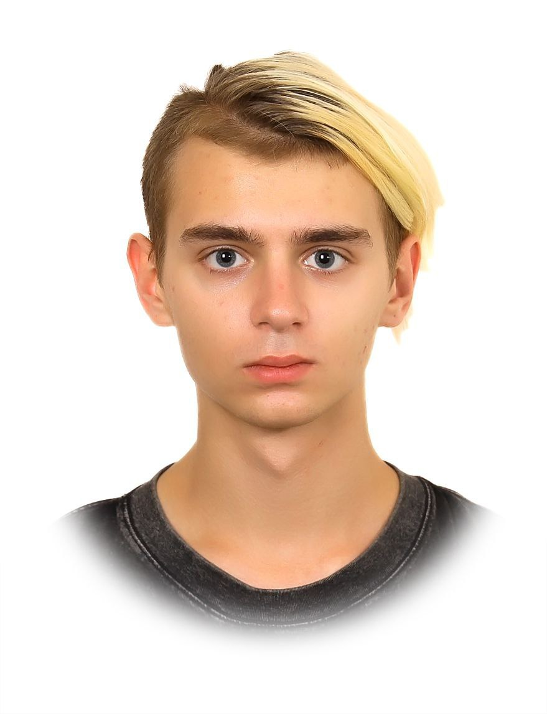

## About

Привет, я Андрей, получил диплом СПО 2025 по специальности Информационные системы и программирование, сейчас поступаю туда же в ВУЗ. 
Программирую на C++/Python, увлекаюсь low-level технологиями. И автоматизацией своих рутинных задач посредством создания пэт проектов. 
### Open Source Projects:

### [--> Консольный пакман](https://github.com/AndreyBatuev/pacmanConsole)

### [--> ASCII генератор для текста картинок и видео](https://github.com/AndreyBatuev/iWroteTheBookHowToBeASCIIForDummis)

### [--> Маленький самодельный автокликер на базе PyAutoGUI](https://github.com/AndreyBatuev/WineAutoclicker)

### [--> Дипломная работа на базе Windows forms с использованием SQL](https://github.com/AndreyBatuev/myGraduateWork)

### Hard-skills 🎓  
####  Основные  
- `C++`, `Python`, `SQL`, `Git`  
####  Дополнительные  
- `STL`, `PyAutoGUI`, `Pillow`, `GTK+`, `Windows Forms`  
####  Языки  
- `English (B1)`   

   

Telegram: 
<a href="https://t.me/AndreyScarlet" >
    
   @AndreyScarlet 

   

   Почта:   
   batushkatas4it@yandex.ru 

